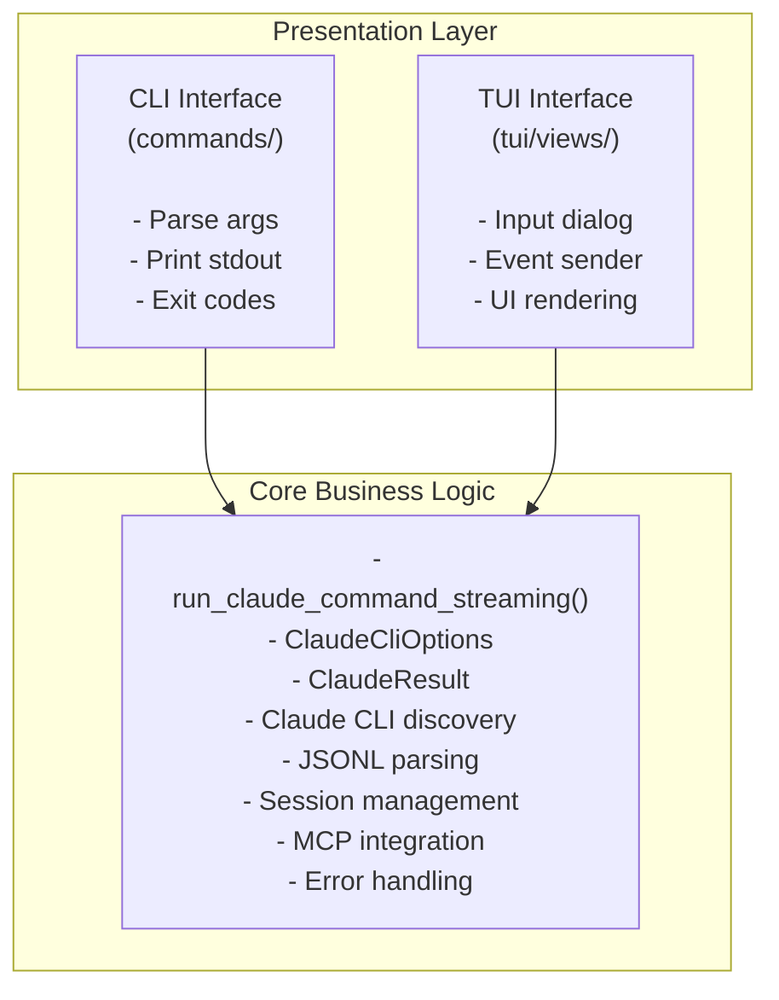

# AGENTS.md

<language>
Respond in English (U.S.) by default. Use Traditional Chinese only when user writes in Traditional Chinese.
</language>

---

<kb-first-principle>
## KB-First = Spec-First

**Core Development Philosophy**: The entire project architecture and logic can be derived from the Knowledge Base. KB-First equals Spec-First.

### Principle

- **Knowledge Base as Source of Truth**: `kb/` directory contains authoritative documentation for:
  - Architecture decisions and patterns
  - Workflows and processes
  - API references and tool schemas
  - Development guidelines and best practices
  - Design specifications and flow diagrams

- **Code Implements KB**: Implementation follows what is specified in the Knowledge Base, not the other way around
  - Design in KB → Implement in code
  - Document workflows in KB → Build features accordingly
  - Define patterns in KB → Apply consistently in codebase

- **Documentation-Driven Development**:
  - All architectural decisions documented before implementation
  - Workflows and state machines defined in KB before coding
  - API contracts and tool schemas specified in KB first

### Simplicity & Minimalism

- **YAGNI (You Aren't Gonna Need It)**: Start with minimal viable solution
- **Delete Aggressively**: Remove unused code and UI elements
- **Minimal Complexity**: Only add features that are immediately needed

### Examples

**Keybinding Management** (KB-First approach):
1. Define all keybindings in `kb/03-api-reference/keybindings.md` (source of truth)
2. Implement mapping logic in `crates/rstn/src/tui/keybindings.rs` (code follows KB)
3. Code reads from KB specification, not the reverse

**State Machine Workflows** (KB-First approach):
1. Document workflow architecture in `kb/99-archive/v2-ux-redesign-state-machine.md`
2. Define state transitions and validation rules in KB
3. Implement state machine based on KB specification

**MCP Tools** (KB-First approach):
1. Define tool schemas in `kb/03-api-reference/mcp-tools.md`
2. Document communication patterns in `kb/03-api-reference/claude-code-communication.md`
3. Implement MCP server following KB specifications

### Benefits

1. **Single Source of Truth**: No confusion about intended behavior or architecture
2. **Onboarding Efficiency**: New contributors can understand the system from KB alone
3. **Design Validation**: Document and review designs before implementation effort
4. **Consistency**: All implementations follow documented patterns
5. **Traceability**: Every feature traces back to KB documentation

### Workflow Integration

This principle integrates with the SDD (Specification-Driven Development) workflow:

- **spec.md** in feature directories follows KB-First principle (spec before code)
- **plan.md** references KB architecture patterns and constraints
- **tasks.md** generated based on KB workflow definitions
- Implementation validates against both feature spec AND KB principles

**Before implementing ANY feature**:
1. Check KB for existing patterns and guidelines
2. Document new patterns in KB if needed
3. Follow KB architectural principles
4. Update KB if new insights emerge (but spec comes first)

See: `kb/00-index.md` for Knowledge Base navigation and structure.
</kb-first-principle>

---

<state-first-architecture>
## State-First Architecture

**State is King**: At any time, rstn's entire state MUST be JSON/YAML serializable.

### Core Principles

- **UI = render(State)**: UI is a pure function of state
- **Testing**: Test state transitions, not UI coordinates
- **No Hidden State**: All state must be serializable (no closures, thread-locals, non-serializable types)
- **State Structs**: All state structs MUST derive `Serialize + Deserialize + Debug + Clone`

### Critical Requirements

1. **State tests MANDATORY**: Round-trip serialization + transitions + invariants
2. All state structs derive `Serialize + Deserialize + Debug + Clone`
3. NO hidden state (closures, thread-locals, non-serializable types)
4. See `kb/04-development/testing-guide.md` for examples
5. See `kb/02-architecture/state-first.md` for principles

### Key v2 Insights

- State-first architecture = core differentiator from v1
- Test state, not UI (stable, observable, deterministic)
- CLI/TUI share business logic (test via CLI first)
- v1 archived (God classes, tight coupling, fragile tests)

### References

- `kb/02-architecture/state-first.md` - **🎯 CORE PRINCIPLE**: All state MUST be JSON/YAML serializable
- `kb/02-architecture/core-principles.md` - Three pillars (state-first, CLI/TUI separation, testing-first)
- `kb/04-development/testing-guide.md` - How to write state tests (round-trip, transitions, invariants)
</state-first-architecture>

---

<workflow-driven-ui>
## Workflow-Driven UI (The "n8n" Model)

The TUI is shifting from a static document viewer to a **Workflow Launcher**.

### 1. Command as Workflow Trigger

- **Left Panel (Commands)**: This is NOT a menu. It is a list of available Workflows.
- **Action**: Selecting a command triggers a Workflow (e.g., "Prompt Claude", "Git Commit").
- **Constraint**: **Single Active Workflow**. Only one workflow can be active/executing at a time. The UI must block new triggers while a workflow is running.
- **Agent Integration**: AI Agents (Claude Code) are invoked *only* when the workflow reaches a specific node requiring intelligence.

### 2. Dynamic Content Area

- **Middle Panel (Content)**: This area is DYNAMIC.
- **Function**: It visualizes the current state of the active Workflow Node.
- **Examples**:
    - *Idle*: "Select a workflow to start..."
    - *Prompting*: Show Input Dialog.
    - *Streaming*: Show Token Stream.
    - *Reviewing*: Show Diff View.
    - *Specifying*: Show Spec Preview.

### 3. Log Obsolescence

- **No Log Panel**: Detailed logs are persisted to `~/.rstn/logs/`.
- **UI Focus**: The UI should only show information critical to the developer's immediate decision-making.

### 4. No Tab Bar

- **Focus**: The interface should be focused on the current task (Worktree).
- **Navigation**: "Settings" or "Dashboard" can be accessed via specific commands or hotkeys, not always-on tabs.
</workflow-driven-ui>

---

<chain-of-thought>
Before starting ANY feature work, work through these steps IN ORDER:

<step number="1" name="WHAT">
  - Feature number: ___
  - Feature name: ___
  - User-facing outcome: ___
</step>

<step number="2" name="WHERE in SDD">
  - spec.md exists? YES/NO
  - plan.md exists? YES/NO
  - tasks.md exists? YES/NO
  - Current phase: SPECIFY | PLAN | TASKS | IMPLEMENT | TEST
</step>

<step number="3" name="NEXT ACTION">
  - If no spec → /speckit.specify
  - If no plan → /speckit.plan
  - If no tasks → /speckit.tasks
  - If tasks exist → implement next task
  - If implemented → dispatch to tui-tester
</step>

<step number="4" name="TESTS NEEDED">
  - Unit tests: ___
  - Integration tests: ___
  - TUI e2e tests: ___ (dispatch to tui-tester)
</step>

<step number="5" name="COMPLETE?">
  - All tasks done? YES/NO
  - All tests pass? YES/NO
  - cargo clippy clean? YES/NO
  - Ready for PR? YES/NO
</step>

You MUST write out these 5 steps before writing any code.
</chain-of-thought>

---

<decision-trees>

<tree name="Which SDD Workflow">
START: New work?
│
├─► Estimated LOC > 500?
│   └─ YES → Full SDD (spec + plan + tasks)
│
├─► Touches > 5 files?
│   └─ YES → Full SDD
│
├─► Architecture change?
│   └─ YES → Full SDD
│
├─► rush feature (Phase 7-8)?
│   └─ YES → Full SDD
│
├─► Complex algorithm or new domain concept?
│   └─ YES → Full SDD
│
└─► Otherwise → Lightweight SDD (spec only)
    │
    ├─ Full SDD path:
    │  /speckit.specify → /speckit.plan → /speckit.tasks → implement
    │
    └─ Lightweight SDD path:
       /speckit-lite → implement directly (no plan/tasks)

See: kb/04-sdd-workflow/when-to-use-which.md for detailed guide
</tree>

<tree name="When to use Design-First Planning">
START: Planning rstn TUI feature?
│
├─► Does feature involve interactive flow?
│   ├─ YES → Continue checking
│   └─ NO → Use standard SDD workflow
│
├─► Does it involve ANY of these?
│   ├─ rstn ↔ Claude Code communication → Design-First Planning REQUIRED
│   ├─ rstn ↔ MCP server interaction → Design-First Planning REQUIRED
│   ├─ Multi-step user workflows → Design-First Planning REQUIRED
│   ├─ State machine (>3 states) → Design-First Planning REQUIRED
│   ├─ Async operations / streaming → Design-First Planning REQUIRED
│   └─ Simple UI-only change → Standard SDD
│
└─► Use Design-First Planning:
    Plan phase MUST include:
    1. Flow chart (Mermaid)
    2. Sequence chart (Mermaid)
    3. State machine (Mermaid)
    4. Logging specification
    5. Verification method

Examples requiring Design-First Planning:
- Prompt Claude command (rstn → Claude → MCP)
- Task execution workflow (multi-step states)
- Commit review flow (state machine)
- Stream processing (async + parsing)

Examples NOT requiring Design-First:
- Add new widget (simple UI)
- Update styling (no interaction)
- Bug fix (no new flow)
</tree>

<tree name="Design-First Planning Requirements">
When plan.md involves interactive flows, MUST include these sections:

1. Flow Diagram (Mermaid)
   - How does data flow through the system?
   - What components are involved?
   - rstn → Claude → MCP → back?

2. Sequence Diagram (Mermaid)
   - Timeline of interactions
   - Who calls whom? When?
   - What messages are exchanged?

3. State Machine (Mermaid)
   - What states exist?
   - What triggers transitions?
   - What are the state variables?

4. Logging Specification
   - What events to log?
   - What format (panel vs file)?
   - What checkpoints to verify?

5. Verification Method
   - How to test this flow?
   - What are observable checkpoints?
   - How to reproduce issues?

Template: See kb/01-architecture/ for examples:
- worktree-view-redesign.md (UI/UX)
- rstn-integration-flow.md (Flow + Sequence)
- worktree-state-machine.md (State Machine)
- logging-specification.md (Logging)
</tree>

<tree name="SDD Workflow (Full)">
START: New feature request (using Full SDD)
│
├─► Does spec.md exist?
│   ├─ NO → Run /speckit.specify, then /speckit.clarify if needed
│   └─ YES → Continue
│
├─► Does plan.md exist?
│   ├─ NO → Check if Design-First Planning needed
│   │        (see "When to use Design-First Planning" tree)
│   │        │
│   │        ├─ YES → Run /speckit.plan WITH flow diagrams
│   │        │        MUST include:
│   │        │        - Flow chart (Mermaid)
│   │        │        - Sequence chart (Mermaid)
│   │        │        - State machine (Mermaid)
│   │        │        - Logging specification
│   │        │        - Verification method
│   │        │
│   │        └─ NO → Run /speckit.plan (standard)
│   │
│   └─ YES → Continue
│
├─► Does tasks.md exist?
│   ├─ NO → Run /speckit.tasks
│   └─ YES → Continue
│
├─► Are all tasks complete?
│   ├─ NO → Implement next task
│   │        If Design-First: Implement logging FIRST
│   │        Then implement feature following flow diagrams
│   └─ YES → Continue
│
├─► Do all tests pass?
│   ├─ NO → Fix failing tests
│   └─ YES → Continue
│
└─► END: Create PR with /speckit.review
</tree>

<tree name="Dispatch to tui-tester">
START: Need TUI testing?
│
├─► Does feature touch TUI code?
│   ├─ NO → Skip tui-tester, use regular unit tests
│   └─ YES → Continue
│
├─► What TUI component?
│   ├─ Mouse handling → Dispatch with mouse context
│   ├─ Keyboard handling → Dispatch with keyboard context
│   ├─ View/Focus → Dispatch with state context
│   └─ Widget rendering → Dispatch with render context
│
└─► Prepare context, then dispatch:
    Task(subagent_type="tui-tester", prompt="<context>...</context>")
</tree>

<tree name="Claude CLI Integration">
START: rstn needs to call Claude CLI?
│
├─► What mode?
│   ├─ Headless/programmatic → Use `-p` (print mode)
│   └─ Interactive → Use default (no -p)
│
├─► Need streaming output?
│   ├─ YES → `--output-format stream-json`
│   │        └─► MUST add `--verbose` flag (required with -p + stream-json)
│   └─ NO → `--output-format json` or `text`
│
├─► Need partial messages?
│   ├─ YES → `--include-partial-messages` (requires stream-json)
│   └─ NO → Skip flag
│
├─► Using MCP?
│   ├─ YES → `--mcp-config ~/.rstn/mcp-session.json`
│   │        Config format: `{"mcpServers":{"rstn":{"type":"http","url":"..."}}}`
│   └─ NO → Skip flag
│
├─► Custom system prompt?
│   ├─ Replace all → `--system-prompt-file /path/to/file`
│   └─ Append → `--append-system-prompt "extra instructions"`
│
└─► END: Build command with all required flags
    See: kb/02-api-reference/claude-cli-reference.md
</tree>

</decision-trees>

---

<few-shot-examples>

<example name="Complete SDD Workflow">
User: "Add click support for tabs"

<thinking>
STEP 1: WHAT
- Feature: 001-click-function
- Outcome: Users can click tabs to switch views

STEP 2: WHERE in SDD
- spec.md: NO
- Current phase: SPECIFY

STEP 3: NEXT ACTION
→ Run /speckit.specify

STEP 4: TESTS NEEDED
- Unit: test_mouse_click_settings_tab
- TUI e2e: Dispatch to tui-tester

STEP 5: COMPLETE?
- All tasks done: NO
- Tests pass: NO
- clippy clean: NO
</thinking>

Action: /speckit.specify
</example>

<example name="Dispatching to tui-tester">
After implementing mouse click handling:

Task(
  subagent_type="tui-tester",
  prompt="""
<context>
  <feature>001-click-function</feature>
  <files>crates/rstn/src/tui/app.rs</files>
  <functions>handle_mouse_event()</functions>
  <state-changes>current_view switches between Worktree/Settings/Dashboard</state-changes>
  <layout>tab_bar_rect stores clickable area (populated after render)</layout>
</context>

<requirements>
  <test>Click on each tab switches view</test>
  <test>Right-click is ignored</test>
  <test>Click outside tab bar is ignored</test>
</requirements>

<helpers>
  <helper>render_app_to_test_backend(app, width, height)</helper>
  <helper>mouse_click(col, row) -> MouseEvent</helper>
  <helper>key_event(code) -> KeyEvent</helper>
</helpers>
"""
)
</example>

<example name="Commit Format">
feat(001): add mouse click support for tabs
fix(001): enable mouse capture in terminal setup
test(001): add e2e tests for tab click handling
</example>

</few-shot-examples>

---

<grounding>

<repository-structure>
rustation/
├── Cargo.toml              # Workspace root
├── AGENTS.md               # This file (AI agent instructions)
├── .claude/agents/
│   └── tui-tester.md       # TUI testing subagent
├── crates/
│   ├── rush/               # Shell implementation
│   └── rstn/src/tui/
│       ├── app.rs          # App, handle_mouse_event, handle_key_event
│       ├── event.rs        # Event types
│       ├── views/          # WorktreeView, SettingsView, Dashboard
│       └── widgets/        # InputDialog, TextInput, OptionPicker
├── specs/{NNN}-{name}/
│   ├── spec.md
│   ├── plan.md
│   └── tasks.md
└── target/                 # Build output (gitignored)
</repository-structure>

<sdd-commands>
| Command | Output | Purpose |
|---------|--------|---------|
| /speckit.specify | spec.md | Define requirements |
| /speckit.clarify | refine spec | Ask clarifying questions |
| /speckit.plan | plan.md | Design architecture |
| /speckit.tasks | tasks.md | Generate task breakdown |
| /speckit.implement | code+tests | Implement feature |
| /speckit.review | PR review | Verify against spec |
| /spec-status | status | Full SDD status |
| /spec-check | quick check | Quick status |
</sdd-commands>

<build-commands>
cargo build -p rstn           # Build TUI app
cargo test -p rstn            # Run all tests
cargo test -p rstn test_mouse # Run mouse tests
cargo clippy -p rstn          # Lint check
</build-commands>

<tui-tester-context-template>
When dispatching to tui-tester, ALWAYS use this structure:

<context>
  <feature>{NNN}-{name}</feature>
  <files>{list of changed files}</files>
  <functions>{entry point functions}</functions>
  <state-changes>{what fields change}</state-changes>
  <layout>{which rects are involved}</layout>
</context>

<requirements>
  <test>{specific test case 1}</test>
  <test>{specific test case 2}</test>
  <test>{edge cases}</test>
</requirements>

<helpers>
  <helper>render_app_to_test_backend(app, width, height)</helper>
  <helper>mouse_click(col, row) -> MouseEvent</helper>
  <helper>key_event(code) -> KeyEvent</helper>
  <helper>key_event_with_mod(code, modifiers) -> KeyEvent</helper>
</helpers>
</tui-tester-context-template>

<claude-cli-docs>
Reference documentation for Claude CLI integration:
- `kb/02-api-reference/claude-cli-reference.md` - Condensed CLI reference
- `kb/02-api-reference/claude-code-cli-reference.md` - Complete CLI reference
- `kb/02-api-reference/claude-headless-mode.md` - Headless mode patterns

Key implementation file:
- `crates/rstn/src/runners/cargo.rs` - `run_claude_command_streaming()`
</claude-cli-docs>

<sources-of-truth>
Internal Commands: `kb/04-reference/cli/commands.md` (Defines active/hidden workflows)
TUI Keybindings: `kb/04-reference/cli/keybindings.md` (Defines all keyboard mappings)
</sources-of-truth>

<knowledge-base>
**rustation v2 Knowledge Base** (reorganized 2025-12-19):

**START HERE**:
- `kb/00-index.md` - Navigation hub for all documentation

**For New Users** (Phase 3 - User Documentation):
- `kb/01-getting-started/installation.md` - Install rstn on your system
- `kb/01-getting-started/quick-start.md` - Run your first session in 10 minutes
- `kb/01-getting-started/concepts.md` - Core concepts (state-first, CLI/TUI, SDD, MCP)

**For Contributors** (Phase 4 - Developer Documentation):
- `kb/04-development/contribution-guide.md` - Setup, workflow, **state testing MANDATORY**
- `kb/04-development/testing-guide.md` - How to write state tests (round-trip, transitions, invariants)
- `kb/04-development/debugging.md` - State inspection, logs, common issues
- `kb/04-development/sdd-workflow.md` - Full vs Lightweight SDD decision guide

**Core Architecture** (Phase 2 - v2 Principles):
- `kb/02-architecture/state-first.md` - **🎯 CORE PRINCIPLE**: All state MUST be JSON/YAML serializable
- `kb/02-architecture/core-principles.md` - Three pillars (state-first, CLI/TUI separation, testing-first)

**API Reference**:
- `kb/03-api-reference/mcp-tools.md` - MCP tool schemas (rstn ↔ Claude Code)
- `kb/03-api-reference/claude-cli.md` - Condensed CLI reference
- `kb/03-api-reference/claude-cli-full.md` - Complete CLI reference
- `kb/03-api-reference/claude-headless.md` - Headless mode patterns

**v1 Archive** (historical reference only):
- `kb/99-archive/` - All v1 content archived (2025-12-19)
- `kb/99-archive/v1-analysis/technical-debt.md` - v1 problems (God classes, state explosion)
- `kb/99-archive/v1-designs/` - Unimplemented v1 designs (worktree redesign, state machine, logging spec)

**CRITICAL REQUIREMENTS for ALL features**:
1. **State tests MANDATORY**: Round-trip serialization + transitions + invariants
2. All state structs derive `Serialize + Deserialize + Debug + Clone`
3. NO hidden state (closures, thread-locals, non-serializable types)
4. See `kb/04-development/testing-guide.md` for examples
5. See `kb/02-architecture/state-first.md` for principles

**Development Workflow**:
- New feature? → See `kb/04-development/sdd-workflow.md` (Full vs Lightweight SDD)
- Writing tests? → See `kb/04-development/testing-guide.md` (state-first testing)
- Debugging? → See `kb/04-development/debugging.md` (state inspection, logs)
- Contributing? → See `kb/04-development/contribution-guide.md` (PR requirements)

**Key v2 Insights**:
- State-first architecture = core differentiator from v1
- Test state, not UI (stable, observable, deterministic)
- CLI/TUI share business logic (test via CLI first)
- v1 archived (God classes, tight coupling, fragile tests)
- SDD effectiveness: 83% success rate with full workflow
</knowledge-base>

</grounding>

---

<negative-constraints>

<rule severity="NEVER">Skip SDD phases → Leads to misaligned code → Follow specify → plan → tasks → implement</rule>
<rule severity="NEVER">Implement without spec → No traceability → Run /speckit.specify first</rule>
<rule severity="NEVER">Implement interactive flow without design diagrams → Leads to complexity → Use Design-First Planning (flow chart, sequence chart, state machine, logging spec)</rule>
<rule severity="NEVER">Skip flow diagrams for rstn TUI features → Can't debug interaction → Create Mermaid diagrams in plan phase</rule>
<rule severity="NEVER">Implement without logging spec → No observability → Define what to log BEFORE coding</rule>
<rule severity="NEVER">Dispatch to tui-tester without context → Agent lacks info → Use context template</rule>
<rule severity="NEVER">Hardcode test coordinates → Breaks on resize → Calculate from layout rects</rule>
<rule severity="NEVER">Forget EnableMouseCapture → Mouse events won't work → Add to terminal setup</rule>
<rule severity="NEVER">Commit without running tests → Broken code enters repo → Run cargo test first</rule>
<rule severity="NEVER">Skip clippy → Lints accumulate → Run cargo clippy before commit</rule>
<rule severity="NEVER">Use -p + stream-json without --verbose → CLI error → Always add --verbose flag</rule>
<rule severity="NEVER">Use "transport" in MCP config → Invalid schema → Use "type" field instead</rule>
<rule severity="NEVER">Implement features without state tests → Untestable code → All features MUST have state serialization and transition tests (see kb/01-architecture/state-serializability.md)</rule>
<rule severity="NEVER">Create non-serializable state → Breaks core principle → All state structs MUST derive Serialize + Deserialize</rule>

<bad-example name="Skip flow diagrams">
User: "Add Prompt Claude command"
Assistant: *Directly implements without creating flow diagrams*
❌ WRONG: Missing Design-First Planning (flow chart, sequence, state machine)
</bad-example>

<bad-example name="No logging spec">
User: "Add MCP tool call"
Assistant: *Implements feature but doesn't specify what to log*
❌ WRONG: Can't debug interaction without logging specification
</bad-example>

<bad-example name="No context dispatch">
Task(subagent_type="tui-tester", prompt="Write mouse tests")
</bad-example>

<bad-example name="Missing file info">
Task(subagent_type="tui-tester", prompt="Test click on tabs")
</bad-example>

</negative-constraints>

---

<delimiters>
Use these markers in workflow updates:

<marker name="SDD STATUS">
Feature: 001-click-function
Phase: IMPLEMENT
Tasks: 3/5 complete
</marker>

<marker name="IMPLEMENTING">
Task: Add mouse click handler
File: crates/rstn/src/tui/app.rs
</marker>

<marker name="DISPATCHING TEST">
Agent: tui-tester
Focus: Mouse click on tab bar
</marker>

<marker name="BUILD CHECK">
cargo build: PASS
cargo test: PASS
cargo clippy: PASS
</marker>

<marker name="READY FOR PR">
All tasks complete, tests pass
</marker>
</delimiters>

---

<output-structure>
After each work session, report in this format:

<report>
  <feature>{NNN}-{name}</feature>

  <sdd-phase>
    <phase name="Specify" status="DONE"/>
    <phase name="Plan" status="DONE"/>
    <phase name="Tasks" status="DONE"/>
    <phase name="Implement" status="IN PROGRESS" progress="3/5"/>
    <phase name="Test" status="PENDING"/>
    <phase name="Review" status="PENDING"/>
  </sdd-phase>

  <tasks-completed>
    <task status="done">Task 1: Description</task>
    <task status="done">Task 2: Description</task>
    <task status="next">Task 3: Next up</task>
  </tasks-completed>

  <tests>
    <test name="test_mouse_click_tab" status="PASS" agent="tui-tester"/>
    <test name="test_right_click_ignored" status="PASS" agent="tui-tester"/>
  </tests>

  <build-status>
    <check name="cargo build" status="PASS"/>
    <check name="cargo test" status="PASS" note="7 new tests"/>
    <check name="cargo clippy" status="PASS"/>
  </build-status>

  <next-steps>
    <step>Implement Task 4</step>
    <step>Dispatch to tui-tester for pane click tests</step>
    <step>Run /speckit.review</step>
  </next-steps>
</report>
</output-structure>

---

<self-correction>
Before committing or creating PR, verify ALL items:

<checklist name="SDD Compliance">
  <item>spec.md exists and is current?</item>
  <item>plan.md exists and was followed?</item>
  <item>tasks.md exists and all tasks complete?</item>
  <item>Implementation matches spec?</item>
</checklist>

<checklist name="Code Quality">
  <item>cargo build passes?</item>
  <item>cargo test passes?</item>
  <item>cargo clippy clean?</item>
  <item>No unwrap() in production code?</item>
</checklist>

<checklist name="Testing">
  <item>Unit tests written?</item>
  <item>TUI e2e tests dispatched to tui-tester?</item>
  <item>All tests pass?</item>
  <item>Edge cases covered?</item>
</checklist>

<checklist name="Commit">
  <item>Commit message format: feat(NNN): description?</item>
  <item>Changes are focused (not mixed features)?</item>
  <item>PR size reasonable (&lt;500 lines ideal)?</item>
</checklist>

If ANY item is NO, fix it before proceeding.
</self-correction>

---

<quick-reference>
SDD WORKFLOW:
  1. /speckit.specify → spec.md
  2. /speckit.plan → plan.md
  3. /speckit.tasks → tasks.md
  4. Implement each task
  5. Dispatch TUI tests to tui-tester
  6. /speckit.review → PR

DISPATCH TO TUI-TESTER:
  Task(subagent_type="tui-tester", prompt="<context>...</context><requirements>...</requirements><helpers>...</helpers>")

BUILD CYCLE:
  cargo build -p rstn
  cargo test -p rstn
  cargo clippy -p rstn

COMMIT FORMAT:
  feat(NNN): description
  fix(NNN): description
  test(NNN): description
</quick-reference>

---

<technologies>
  <tech>Rust 1.75+ (edition 2021)</tech>
  <tech>ratatui 0.29+ (TUI framework)</tech>
  <tech>crossterm 0.28 (terminal I/O)</tech>
  <tech>reedline 0.26+ (line editing)</tech>
  <tech>tokio (async runtime)</tech>
  <tech>tracing (logging)</tech>
</technologies>

<debugging>
  <logs>~/.rustation/logs/</logs>
  <command>tail -f ~/.rustation/logs/rstn.log</command>
  <command>grep -i "keyword" ~/.rustation/logs/rstn.log</command>
  <tip>Use `just install-dev` for hot reload symlinks</tip>
</debugging>

---

## MCP Architecture (Features 060-065)

rstn uses an **embedded HTTP server** for Claude Code communication, replacing fragile text-based status parsing with robust MCP tools.

### Architecture Overview

```mermaid
graph TB
    subgraph rstn["rstn (Main Process)"]
        TUI["TUI Loop<br/>(with InputDialog)"]
        Axum["Axum Server<br/>(dynamic port)"]

        TUI -->|mpsc::channel<br/>(tool requests)| Axum
        Axum -->|oneshot::channel<br/>(user responses)| TUI
    end

    Claude["Claude Code (Subprocess)<br/>spawned with --mcp-config"]

    Claude -->|HTTP POST<br/>/mcp| Axum
    Axum -->|HTTP Response<br/>(Tool Result)| Claude
```

### Sequence Diagram

```
sequenceDiagram
    participant CC as Claude Code (Subprocess)
    participant Server as Axum Server (inside rstn)
    participant UI as TUI Loop (inside rstn)
    participant User

    Note over UI: 1. Start Axum Server (port 0)
    Note over UI: 2. Generate ~/.rstn/mcp-session.json
    UI->>CC: 3. Spawn `claude` with --mcp-config

    CC->>Server: HTTP POST /mcp (tools/call: rstn_report_status)
    Server->>UI: mpsc::send(McpStatus{needs_input})
    UI->>User: Show InputDialog
    User->>UI: Input "Blue feature"
    UI->>Server: oneshot::send(response)
    Server->>CC: HTTP Response (Tool Result)
```

### Control Channel (MCP over HTTP)

Purpose: State transitions and structured communication

- **Protocol**: JSON-RPC 2.0 (Model Context Protocol)
- **Transport**: HTTP POST (recommended by Claude Code, SSE is deprecated)
- **Port**: Dynamic (port 0, auto-assigned)
- **Endpoint**: `http://127.0.0.1:{port}/mcp`

### Available MCP Tools

| Tool | Purpose | Key Parameters |
|------|---------|----------------|
| `rstn_report_status` | Report status changes | status: "needs_input" \| "completed" \| "error" |
| `rstn_read_spec` | Read spec artifacts | artifact: "spec" \| "plan" \| "tasks" \| "checklist" \| "analysis" |
| `rstn_get_context` | Get feature context | (none - returns current feature metadata) |
| `rstn_complete_task` | Mark task complete | task_id: "T001", skip_validation: bool |

### Tool Usage Example

**Old Way (Removed in Feature 064):**
```
❌ Output status block:
```rscli-status
{"status":"needs_input","prompt":"Describe the feature"}
```
```

**New Way (MCP Tools):**
```
✅ Call MCP tool:
rstn_report_status({
  "status": "needs_input",
  "prompt": "Describe the feature"
})
```

### Configuration

rstn automatically writes `~/.rstn/mcp-session.json` for Claude Code to discover the MCP server via `--mcp-config` flag.

### Troubleshooting

| Issue | Cause | Solution |
|-------|-------|----------|
| MCP server not starting | Port binding failed | Uses port 0 (auto-assign). Check logs for actual port. |
| Tool not found | Outdated rstn version | Ensure rstn >= 0.2.0 with Features 060-065 |
| Connection refused | Server not running | Verify `rstn` TUI is active. MCP server starts with TUI. |
| Tools not discovered | Config file missing | Check `~/.rstn/mcp-session.json` exists |
| Input dialog not showing | Event not polled | Ensure `poll_mcp_events()` is called in main_loop |

### Key Points

- **Protocol**: JSON-RPC 2.0 over HTTP (replaced fragile text-based parsing in Feature 064)
- **Communication**: Use MCP tools (`rstn_report_status`, `rstn_complete_task`, etc.) instead of status blocks
- **Auto-discovery**: rstn writes MCP config to `~/.rstn/mcp-session.json` for Claude Code

### Further Reading

- **Tool Schemas**: See `kb/02-api-reference/mcp-tools.md` for detailed tool reference
- **MCP Spec**: [Model Context Protocol](https://modelcontextprotocol.io/)
- **Claude Code MCP Docs**: [claude.com/docs/claude-code/mcp](https://code.claude.com/docs/en/mcp)

---

## CLI/TUI Architecture Pattern

**Core Principle**: CLI and TUI are just different **interfaces** (presentation layers) over the same **core business logic**.

### Architecture Overview



### Shared Core Components

Both CLI and TUI use the **same business logic**:

| Component | Location | Purpose |
|-----------|----------|---------|
| `run_claude_command_streaming()` | `runners/cargo.rs` | Execute Claude CLI with streaming |
| `ClaudeCliOptions` | `runners/cargo.rs` | Configuration (max_turns, permissions, tools) |
| `ClaudeResult` | `runners/cargo.rs` | Result with session_id, success, content |
| `ClaudeStreamMessage` | `tui/claude_stream.rs` | JSONL message parsing |
| `ClaudeDiscovery::find_claude()` | `claude_discovery.rs` | Locate Claude binary |
| MCP config | `domain/paths.rs` | MCP server integration |

### Interface Layer Differences

**What differs** between CLI and TUI is **only** the I/O handling:

| Aspect | CLI | TUI |
|--------|-----|-----|
| **Input** | Command-line args (`clap`) | Input dialog widget |
| **Output** | `stdout`/`stderr` (pipeable) | Event sender → UI renderer |
| **Streaming** | `print!()` + `flush()` | `Event::ClaudeStream` → event loop |
| **Session display** | `eprintln!()` at end | Status widget in UI |
| **Errors** | Exit code (0/non-zero) | Error dialog |
| **User flow** | Single command → result | Multi-step interaction |

### Testing Strategy

**Key Insight**: CLI is easier to test than TUI (direct I/O vs event loops and rendering)

**Development Strategy**: Build CLI first to validate core logic, then add TUI as a UI/UX wrapper. This ensures any TUI issues are interface problems, not logic bugs.

### Benefits of This Pattern

1. **Single source of truth**: Core logic in one place
2. **Easier testing**: Validate via CLI first
3. **Reduced duplication**: No duplicate command building, parsing, error handling
4. **Better maintainability**: Fix bugs in one place
5. **Clear separation**: Interface layer vs business logic

### Implementation

Both CLI and TUI share the same core implementation in `runners/cargo.rs`. See KB for detailed implementation patterns and examples.

---

## Active Technologies
- Rust 1.75+ (edition 2021) + okio, serde_json, thiserror (all already in workspace) (052-internalize-spec-generation)
- File system (`specs/` directory, `features.json`) (052-internalize-spec-generation)
- Rust 1.75+ (edition 2021) + okio, serde, serde_json, thiserror, regex (all in workspace) (053-internalize-clarify)
- File system (`specs/{NNN}-{name}/spec.md`) (053-internalize-clarify)
- Rust 1.75+ (edition 2021) + okio (async runtime), serde_json (JSON parsing), thiserror (error handling), which (CLI detection) - all already in workspace (054-internalize-plan)
- File system - `specs/{NNN}-{name}/` directory structure (054-internalize-plan)

## Recent Changes
- 052-internalize-spec-generation: Added Rust 1.75+ (edition 2021) + okio, serde_json, thiserror (all already in workspace)
