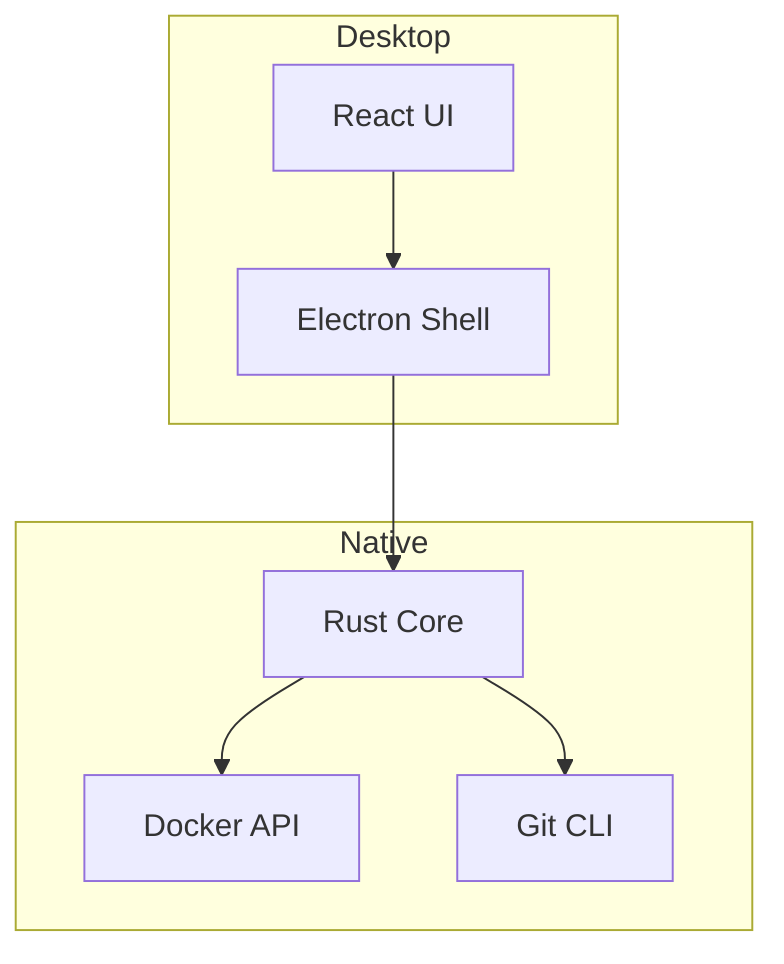

# Introduction

Rustation is a developer workspace management tool for macOS. It provides a visual interface for managing multiple projects, Docker containers, and task automation.

## What is Rustation?

Rustation combines three essential developer workflows into one native desktop application:

1. **Project Management** - Open and switch between multiple git repositories
2. **Container Management** - Start, stop, and monitor Docker services
3. **Task Automation** - Run justfile commands with real-time output

## Architecture

Rustation is built with a hybrid architecture:

- **Frontend**: React with shadcn/ui components
- **Backend**: Rust via napi-rs for native performance
- **Desktop**: Electron for cross-platform support

## Key Concepts

### State-First Architecture

All application state lives in Rust and is JSON-serializable. The React frontend is a pure visualization of this state - it never stores business logic.

### Per-Worktree Isolation

Each git worktree maintains its own:
- Active tab selection
- Docker service selection
- Task output history

This allows working on multiple branches without losing context.

## Next Steps

- [Installation](/guide/installation) - Install Rustation on your Mac
- [Quick Start](/guide/quick-start) - Open your first project
