# 🎯 State Serializability - Core Architecture Principle

**Status**: 🎯 Core Principle (Feature 079)
**Created**: 2025-12-18
**Last Updated**: 2025-12-19

---

## TL;DR - For Claude Code

**Core Principle:** At any time, rstn's entire state MUST be JSON/YAML serializable.

**Why:**
- **Testability**: State-based tests are observable, deterministic, and stable
- **Reproducibility**: Save state → load state → exact bug reproduction
- **Clarity**: State is the single source of truth, UI is derived

**Testing Requirements (MANDATORY):**
1. Every feature MUST include state serialization round-trip test
2. Every feature MUST include state transition tests
3. State structs MUST derive `Serialize + Deserialize + Debug + Clone`
4. NO hidden state (closures, thread-locals, unserializable fields)

**Enforcement:**
- CI checks: All state structs derive required traits
- Code review: State tests required for PR approval
- Test coverage: State tests are NOT optional

**Quick Example:**
```rust
#[derive(Debug, Clone, Serialize, Deserialize, PartialEq)]
pub struct AppState {
    pub version: String,
    pub worktree_view: WorktreeViewState,
    pub dashboard_view: DashboardState,
    pub settings_view: SettingsState,
}

#[test]
fn test_state_round_trip() {
    let state = AppState::default();
    let json = serde_json::to_string(&state).unwrap();
    let loaded: AppState = serde_json::from_str(&json).unwrap();
    assert_eq!(state, loaded); // MUST pass
}
```

---

## Core Principle

> **At any time, at any moment, rstn's entire state MUST be representable as JSON/YAML.**

This means:
- Every piece of application state can be serialized
- State can be saved, loaded, and restored exactly
- UI is a pure function of state: `UI = render(State)`
- No hidden state, no implicit assumptions
- All mutations go through explicit state transitions

---

## Why State Serializability?

### 1. **Testability**
State-based testing is **observable** and **deterministic**:

```rust
#[test]
fn test_prompt_workflow() {
    // Load known initial state
    let state = AppState::from_json(r#"{
        "input_mode": false,
        "session_id": null
    }"#);

    let mut app = App::from_state(state).unwrap();

    // Trigger action
    app.handle_view_action(ViewAction::RunPromptClaude {
        prompt: "test".into()
    });

    // Assert state transition
    let final_state = app.to_state();
    assert!(final_state.session_id.is_some());
    assert_eq!(final_state.input_mode, false);
}
```

**vs. UI testing** (hard to observe):
```rust
// ❌ Fragile: depends on rendering coordinates
let buffer = terminal.backend().buffer();
assert_eq!(buffer.get(10, 5).symbol, "│");
```

### 2. **Reproducible Bugs**
Users can save state when bugs occur:

```bash
# User hits bug
rstn --save-state bug-report.json

# Developer loads exact state
rstn --load-state bug-report.json
# → Perfect reproduction
```

### 3. **Session Persistence**
Save on exit, restore on startup:

```yaml
# ~/.rstn/session.yaml
version: "0.1.0"
current_view: Worktree
input_mode: false
worktree_view:
  focus: GitStatus
  current_branch: "feature/042"
  session_id: "abc123-def456"
  claude_output:
    - type: assistant
      text: "Previous conversation..."
```

### 4. **Time-Travel Debugging**
Record all state transitions:

```rust
let mut history: Vec<AppState> = vec![];

loop {
    history.push(app.to_state()); // Snapshot
    app.handle_event(event);
}

// When bug occurs:
save_history("debug-trace.json", &history);
// → Replay state transitions to find exact failure point
```

### 5. **Clear Single Source of Truth**
State is **explicit** and **centralized**:
- No scattered state across components
- No "magic" hidden state
- No implicit dependencies
- Easy to reason about

---

## Architecture

### State-Driven Design

```
┌─────────────────────────────────────────┐
│           Single State Tree             │
│         (Serializable to JSON)          │
│                                         │
│  AppState {                             │
│    version: String,                     │
│    current_view: ViewType,              │
│    input_mode: bool,                    │
│    worktree_view: WorktreeViewState,    │
│    settings_view: SettingsViewState,    │
│    dashboard_view: DashboardState,      │
│    mcp_server: McpServerState,          │
│  }                                      │
│                                         │
│  All derives: Serialize + Deserialize   │
└────────────┬────────────────────────────┘
             │
             │ Pure function
             │ UI = render(state)
             ▼
┌─────────────────────────────────────────┐
│          UI Layer (TUI/CLI)             │
│      Derived from state, no logic       │
│                                         │
│  - Tabs (from current_view)             │
│  - Input dialog (from input_mode)       │
│  - Git status (from worktree_view)      │
│  - All widgets = views of state         │
└─────────────────────────────────────────┘
```

### State Transition Pattern

All mutations go through explicit state transitions:

```rust
impl App {
    pub fn handle_action(&mut self, action: ViewAction) -> Result<()> {
        // 1. Log old state (for debugging)
        let old_state = self.to_state();
        tracing::debug!(state = ?old_state, "Before action");

        // 2. Perform state transition
        match action {
            ViewAction::RunPromptClaude { prompt } => {
                // Explicit state mutations
                self.worktree_view.session_id = Some(generate_id());
                self.worktree_view.pending_response = true;
                self.worktree_view.last_prompt = Some(prompt);
            }
            ViewAction::SwitchView(view) => {
                self.current_view = view;
            }
            // ...
        }

        // 3. Log new state
        let new_state = self.to_state();
        tracing::debug!(
            old = ?old_state,
            new = ?new_state,
            "State transition"
        );

        Ok(())
    }
}
```

### State Transition Diagram

```mermaid
stateDiagram-v2
    [*] --> Idle: App starts

    Idle --> LoadingState: --load-state flag
    LoadingState --> Idle: State loaded
    LoadingState --> Error: Load failed

    Idle --> Running: User action

    state Running {
        [*] --> Processing: handle_action()
        Processing --> ValidateAction: Check preconditions
        ValidateAction --> MutateState: Valid
        ValidateAction --> Error: Invalid
        MutateState --> LogTransition: State changed
        LogTransition --> [*]: Done
    }

    Running --> Idle: Action complete

    Idle --> SavingState: --save-state flag / Exit
    SavingState --> [*]: State saved
    SavingState --> Error: Save failed

    Error --> Idle: Error handled

    note right of Running
        All state mutations happen here
        Old state → Action → New state
        Logged for debugging
    end note

    note right of SavingState
        Serialize to JSON/YAML
        Can be loaded later
        Perfect reproduction
    end note
```



---

## Common Pitfalls

### ❌ Antipattern: Hidden State

**Problem**: State not in the state tree
```rust
// ❌ BAD: State in closure (not serializable)
let counter = Rc::new(RefCell::new(0));
button.on_click(move || {
    *counter.borrow_mut() += 1; // Hidden state!
});

// ✅ GOOD: State in AppState
pub struct AppState {
    pub click_count: usize, // Serializable
}
app.handle_action(ViewAction::ButtonClick); // Explicit transition
```

### ❌ Antipattern: Non-Serializable Types

**Problem**: Fields that can't be serialized
```rust
// ❌ BAD: Function pointer (not serializable)
pub struct AppState {
    pub callback: fn() -> (), // Can't serialize!
}

// ❌ BAD: Thread handle (not serializable)
pub struct AppState {
    pub worker: JoinHandle<()>, // Can't serialize!
}

// ✅ GOOD: Only data, no behavior
pub struct AppState {
    pub callback_name: String, // Serializable ID
    pub worker_id: Option<String>, // Serializable reference
}
```

### ❌ Antipattern: Implicit State

**Problem**: State derived but not stored
```rust
// ❌ BAD: Computed on-the-fly (inconsistent)
impl App {
    pub fn is_ready(&self) -> bool {
        self.feature.is_some() && !self.is_running // Not stored!
    }
}

// ✅ GOOD: Explicit state field
pub struct AppState {
    pub is_ready: bool, // Stored in state
}

impl App {
    pub fn compute_ready(&mut self) {
        self.is_ready = self.feature.is_some() && !self.is_running;
    }
}
```

### ❌ Antipattern: Mutable Global State

**Problem**: State outside the state tree
```rust
// ❌ BAD: Global mutable state
static mut CURRENT_SESSION: Option<String> = None;

// ✅ GOOD: State in AppState
pub struct AppState {
    pub current_session: Option<String>,
}
```

### ✅ Best Practices

1. **Everything in the state tree**: If it affects behavior, it's in `AppState`
2. **Derive required traits**: `Serialize + Deserialize + Debug + Clone + PartialEq`
3. **Use `#[serde(skip)]` sparingly**: Only for true caches (recomputable from other state)
4. **Store IDs, not objects**: `session_id: String`, not `session: Session`
5. **Test round-trips**: Every state struct has a serialization test

---

## Implementation Requirements

### 1. State Structs Must Be Serializable

All state structs **MUST** derive:
- `Serialize` (serde)
- `Deserialize` (serde)
- `Debug` (for logging)
- `Clone` (for snapshotting)

```rust
use serde::{Serialize, Deserialize};

#[derive(Debug, Clone, Serialize, Deserialize)]
pub struct AppState {
    pub version: String,
    pub current_view: ViewType,
    pub input_mode: bool,
    pub worktree_view: WorktreeViewState,
    // ... all app state
}

#[derive(Debug, Clone, Serialize, Deserialize)]
pub struct WorktreeViewState {
    pub focus: WorktreeFocus,
    pub current_branch: Option<String>,
    pub git_status: Vec<GitStatusEntry>,
    pub session_id: Option<String>,
    pub claude_output: Vec<OutputLine>,
    // ... all view state
}
```

### 2. Bidirectional Conversion

Apps/Views must implement `to_state()` and `from_state()`:

```rust
impl App {
    /// Convert app to serializable state
    pub fn to_state(&self) -> AppState {
        AppState {
            version: env!("CARGO_PKG_VERSION").to_string(),
            current_view: self.current_view,
            input_mode: self.input_mode,
            worktree_view: self.worktree_view.to_state(),
            settings_view: self.settings_view.to_state(),
            mcp_server: self.mcp_state.lock().unwrap().to_state(),
        }
    }

    /// Reconstruct app from state
    pub fn from_state(state: AppState) -> Result<Self> {
        Ok(App {
            current_view: state.current_view,
            input_mode: state.input_mode,
            worktree_view: WorktreeView::from_state(state.worktree_view)?,
            settings_view: SettingsView::from_state(state.settings_view)?,
            mcp_state: Arc::new(Mutex::new(McpState::from_state(state.mcp_server)?)),
            // ...
        })
    }
}
```

### 3. No Hidden State

**Forbidden**:
- State in `Rc<RefCell<T>>` that's not serialized
- State in closures
- State in thread-local storage
- Implicit state in external systems (without serializing references)

**Required**:
- All state in the state tree
- External references stored as IDs (e.g., `session_id: String`)
- Transient state marked clearly (e.g., `#[serde(skip)]` for caches)

---

## Testing Requirements

### Mandatory Tests for All Features

Every feature **MUST** include:

#### 1. State Serialization Round-Trip Test
```rust
#[test]
fn test_state_serialization_round_trip() {
    let app = App::new_for_test();

    // Serialize
    let state = app.to_state();
    let json = serde_json::to_string(&state).unwrap();

    // Deserialize
    let loaded_state: AppState = serde_json::from_str(&json).unwrap();
    let loaded_app = App::from_state(loaded_state).unwrap();

    // Must be identical
    assert_eq!(app.to_state(), loaded_app.to_state());
}
```

#### 2. State Transition Tests
```rust
#[test]
fn test_feature_state_transitions() {
    // Load initial state
    let initial = AppState {
        input_mode: false,
        session_id: None,
        // ...
    };
    let mut app = App::from_state(initial).unwrap();

    // Trigger action
    app.handle_view_action(ViewAction::RunPromptClaude {
        prompt: "test".into()
    });

    // Assert state changed correctly
    let final_state = app.to_state();
    assert!(final_state.session_id.is_some());
    assert_eq!(final_state.input_mode, false);
    assert!(final_state.worktree_view.pending_response);
}
```

#### 3. State Invariant Tests
```rust
#[test]
fn test_state_invariants() {
    let state = app.to_state();

    // Invariants that must always hold:

    // Example: input_dialog is Some iff input_mode is true
    if state.input_mode {
        assert!(state.input_dialog.is_some());
    } else {
        assert!(state.input_dialog.is_none());
    }

    // Example: session_id exists iff claude_output is non-empty
    if !state.worktree_view.claude_output.is_empty() {
        assert!(state.worktree_view.session_id.is_some());
    }
}
```

---

## Comparison: State Testing vs UI Testing

| Aspect | State Testing | UI Testing |
|--------|---------------|------------|
| **Observability** | ✅ Direct field access | ❌ Parse TestBackend buffer |
| **Stability** | ✅ Stable APIs | ❌ Breaks on layout changes |
| **Speed** | ✅ Fast (no rendering) | ❌ Slow (full render cycle) |
| **Clarity** | ✅ `assert_eq!(app.input_mode, true)` | ❌ `buffer.get(10, 5).symbol == "│"` |
| **Maintainability** | ✅ Refactor-safe | ❌ Brittle coordinate checks |
| **Determinism** | ✅ Pure state transitions | ❌ Depends on terminal size |

**When to use each**:
- **State testing**: Business logic, workflows, state transitions (95% of tests)
- **UI testing**: Layout bugs, visual regressions, widget rendering (5% of tests)

---

## CLI vs TUI: Same Core, Different Interfaces

Both CLI and TUI are **interfaces** over the same **state**:

```
┌────────────────────────────────────────────┐
│         Presentation Layer                 │
│  ┌──────────────┐    ┌──────────────┐     │
│  │ CLI Interface│    │ TUI Interface│     │
│  │              │    │              │     │
│  │ - Parse args │    │ - Events     │     │
│  │ - Print stdout│   │ - Rendering  │     │
│  └──────┬───────┘    └──────┬───────┘     │
└─────────┼────────────────────┼─────────────┘
          │                    │
          └─────────┬──────────┘
                    │
        ┌───────────▼────────────┐
        │    Core State Logic    │
        │  (runners/cargo.rs)    │
        │                        │
        │  - Business logic      │
        │  - State transitions   │
        │  - Side effects        │
        └────────────────────────┘
```

**Testing Strategy**:
1. **Test state via CLI first** (easy: input → output)
2. **Then test TUI** (only UI behavior, core already validated)
3. **Result**: If CLI passes, TUI issues are UI/UX only

---

## File Structure

```
crates/rstn/src/
├── tui/
│   ├── state.rs           # ← NEW: AppState, WorktreeViewState, etc.
│   ├── app.rs             # App::to_state(), App::from_state()
│   └── views/
│       ├── worktree/
│       │   ├── view.rs    # WorktreeView::to_state()
│       │   └── state.rs   # ← NEW: WorktreeViewState
│       └── ...
└── commands/
    └── state.rs           # ← NEW: CLI for --save-state, --load-state
```

---

## Enforcement

### CI Checks
- All state structs derive `Serialize + Deserialize`
- Round-trip tests pass for all views
- State coverage > 80% (all fields tested)

### Code Review Checklist
- [ ] New features include state tests
- [ ] State structs are serializable
- [ ] `to_state()` and `from_state()` implemented
- [ ] No hidden state introduced
- [ ] State invariants documented and tested

### SDD Workflow
When creating plan.md for new features:
- **Task N**: Define state structs
- **Task N+1**: Implement state tests
- **Task N+2**: Implement feature logic

State tests come **before** implementation.

---

## Future Enhancements

### Phase 1 (Feature 079)
- [x] Document principle in KB
- [ ] Create `tui/state.rs` with AppState
- [ ] Implement `App::to_state()` / `from_state()`
- [ ] Add state tests for existing features
- [ ] Update CLAUDE.md with testing requirements

### Phase 2 (Feature 080)
- [ ] Session persistence (`~/.rstn/session.yaml`)
- [ ] `--save-state` / `--load-state` CLI flags
- [ ] State changelog for version migrations

### Phase 3 (Future)
- [ ] Time-travel debugging (record all transitions)
- [ ] State diff viewer (before/after comparisons)
- [ ] State replay for bug reproduction

---

## References

- **Similar Architectures**:
  - Elm Architecture (Model is serializable)
  - Redux (State tree is plain JSON)
  - Jupyter Notebooks (Serialize execution state)
  - Emacs (Save/restore sessions)

- **Related KB Docs**:
  - `kb/01-architecture/rstn-tui-architecture.md` - TUI design
  - `kb/04-sdd-workflow/when-to-use-which.md` - Testing strategy
  - `CLAUDE.md` - CLI/TUI Architecture Pattern

---

**Key Takeaway**: State is the single source of truth. UI is derived. Tests assert state, not UI.
