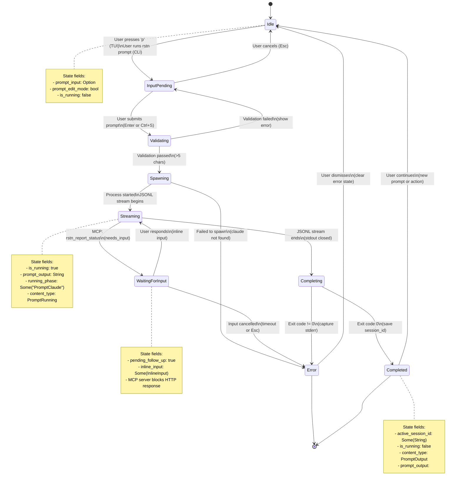
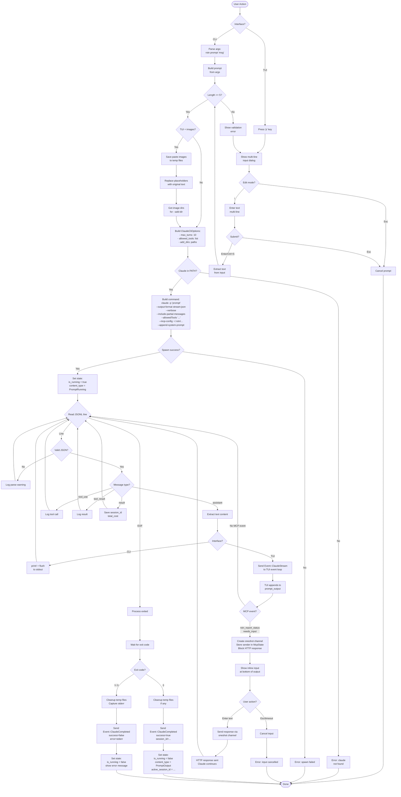
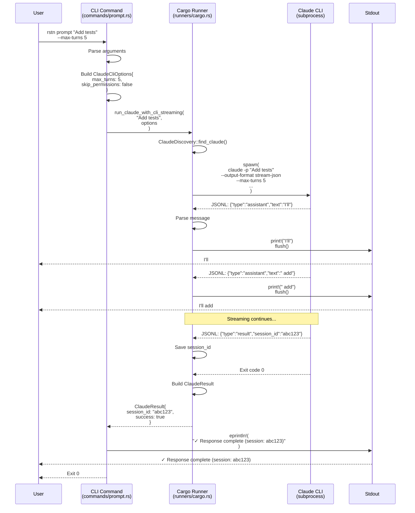

# Prompt Claude Command Architecture

**Last Updated**: 2025-12-20
**Status**: Reference Documentation
**Scope**: Developer guide to the Prompt Claude workflow implementation

---

## Overview

The **Prompt Claude** command is a stateful workflow that enables users to interact with Claude Code from both CLI and TUI interfaces. It demonstrates the CLI/TUI separation pattern where both interfaces share the same core business logic but differ only in I/O handling.

**Key Characteristics**:
- ✅ Stateful workflow with 9 distinct states
- ✅ Supports both CLI (`rstn prompt "..."`) and TUI (press `p`)
- ✅ Real-time streaming output (JSONL parsing)
- ✅ Bidirectional MCP communication (rstn ↔ Claude Code)
- ✅ Session continuity (resume/continue)
- ✅ Image paste support (TUI only)
- ✅ Async execution with event-driven updates

---

## State Diagram

The Prompt Claude workflow transitions through 9 states:



---

## Flow Chart

The execution flow differs slightly between CLI and TUI but shares the core logic:



---

## Sequence Diagram

### TUI Mode (Full Interaction with MCP)

```mermaid
sequenceDiagram
    participant User
    participant TUI as TUI Event Loop<br/>(app.rs)
    participant View as WorktreeView<br/>(views/worktree/view.rs)
    participant Runner as Cargo Runner<br/>(runners/cargo.rs)
    participant Claude as Claude CLI<br/>(subprocess)
    participant MCP as MCP Server<br/>(mcp_server.rs)

    Note over User,MCP: Phase 1: Prompt Input
    User->>TUI: Press 'p' key
    TUI->>View: KeyEvent('p')
    View->>View: Create TextInput dialog<br/>prompt_edit_mode = false
    View-->>TUI: Render prompt dialog

    User->>TUI: Press 'i' (edit mode)
    TUI->>View: KeyEvent('i')
    View->>View: prompt_edit_mode = true
    View-->>TUI: Render editable state

    User->>TUI: Type "Add tests"
    TUI->>View: KeyEvent(Char('A'))...
    View->>View: prompt_input.insert_char()
    View-->>TUI: Render with text

    User->>TUI: Press Enter/Ctrl+S
    TUI->>View: KeyEvent(Enter)
    View->>View: submit_prompt_input()
    View->>View: Validate length >= 5
    View->>View: Get text from input
    View-->>TUI: ViewAction::RunPromptClaude{<br/>  prompt: "Add tests"<br/>}

    Note over User,MCP: Phase 2: Execution Start
    TUI->>TUI: Handle ViewAction::RunPromptClaude
    TUI->>TUI: Save images to temp<br/>(if paste present)
    TUI->>TUI: Replace placeholders
    TUI->>TUI: Get image dirs
    TUI->>TUI: Build ClaudeCliOptions{<br/>  max_turns: 10,<br/>  allowed_tools: [...],<br/>  add_dirs: [temp_dir]<br/>}
    TUI->>View: Set content_type = PromptRunning<br/>is_running = true
    TUI->>Runner: tokio::spawn(<br/>  run_claude_command_streaming(<br/>    "Add tests",<br/>    options,<br/>    event_sender<br/>  )<br/>)

    Note over Runner,Claude: Async Task Started
    Runner->>Runner: ClaudeDiscovery::find_claude()
    Runner->>Runner: Build command args
    Runner->>Claude: spawn(<br/>  claude -p "Add tests"<br/>  --output-format stream-json<br/>  --verbose<br/>  --include-partial-messages<br/>  --allowedTools "..."<br/>  --mcp-config ~/.rstn/...<br/>  --append-system-prompt<br/>)

    Note over User,MCP: Phase 3: Streaming Output
    Claude-->>Runner: JSONL line 1:<br/>{"type":"init",...}
    Runner->>Runner: Parse ClaudeStreamMessage
    Runner->>TUI: Event::ClaudeStream(msg)
    TUI->>View: append_prompt_output()
    View-->>User: Display in output panel

    Claude-->>Runner: JSONL line 2:<br/>{"type":"assistant","text":"I'll",...}
    Runner->>Runner: Extract text "I'll"
    Runner->>Runner: Accumulate in result.content
    Runner->>TUI: Event::ClaudeStream(msg)
    TUI->>View: append_prompt_output("I'll")
    View-->>User: Display incremental text

    Claude-->>Runner: JSONL line 3:<br/>{"type":"assistant","text":" add",...}
    Runner->>TUI: Event::ClaudeStream(msg)
    TUI->>View: append_prompt_output(" add")
    View-->>User: Display "I'll add"

    Note over User,MCP: Phase 4: MCP Interaction (needs_input)
    Claude->>MCP: HTTP POST /mcp<br/>tools/call: rstn_report_status<br/>{status: "needs_input",<br/> prompt: "Which test?"}
    MCP->>MCP: Create oneshot channel<br/>(tx, rx)
    MCP->>MCP: Store tx in McpState
    MCP->>TUI: Event::McpStatus{<br/>  status: "needs_input",<br/>  prompt: "Which test?"<br/>}
    TUI->>View: pending_follow_up = true<br/>inline_input = Some(...)
    View-->>User: Show inline input widget<br/>"Which test?"

    Note over MCP: HTTP handler blocks on rx.await

    User->>TUI: Type "unit tests"
    TUI->>View: KeyEvent(Char('u'))...
    View->>View: inline_input.insert_char()
    View-->>User: Display "unit tests"

    User->>TUI: Press Enter
    TUI->>View: KeyEvent(Enter)
    View->>View: submit_user_input("unit tests")
    View->>MCP: McpState.send_input_response(<br/>  "unit tests"<br/>)
    MCP->>MCP: tx.send("unit tests")
    MCP->>MCP: rx.await → Ok("unit tests")
    MCP-->>Claude: HTTP Response 200<br/>Tool Result: "User response: unit tests"
    Claude->>Claude: Continue execution

    Claude-->>Runner: JSONL line N:<br/>{"type":"assistant","text":"Creating unit tests...",...}
    Runner->>TUI: Event::ClaudeStream(msg)
    TUI->>View: append_prompt_output()
    View-->>User: Display continued response

    Note over User,MCP: Phase 5: Completion
    Claude-->>Runner: JSONL line final:<br/>{"type":"result","success":true,<br/>"session_id":"abc123"}
    Runner->>Runner: Track session_id
    Runner->>Runner: stdout EOF
    Runner->>Claude: Wait for exit
    Claude-->>Runner: Exit code 0

    Runner->>Runner: Cleanup temp files
    Runner->>Runner: Build ClaudeResult{<br/>  session_id: "abc123",<br/>  success: true,<br/>  content: "..."<br/>}
    Runner->>TUI: Event::ClaudeCompleted{<br/>  phase: "PromptClaude",<br/>  success: true,<br/>  session_id: "abc123"<br/>}

    TUI->>View: is_running = false<br/>content_type = PromptOutput<br/>active_session_id = "abc123"
    View-->>User: Show completion status<br/>"✓ Response complete"
```



### CLI Mode (Direct stdout, no MCP interaction)



---

## State Management

### State Fields

The Prompt Claude workflow uses these state fields in `WorktreeView`:

```rust
// Input handling
pub prompt_input: Option<TextInput>,      // Multi-line prompt input widget
pub prompt_edit_mode: bool,               // i/Esc toggle for editing
pub prompt_output: String,                // Accumulated streaming output

// Execution state
pub is_running: bool,                     // Currently executing Claude CLI
pub running_phase: Option<String>,        // "PromptClaude" during execution
pub content_type: ContentType,            // PromptRunning | PromptOutput

// Session management
pub active_session_id: Option<String>,    // For --resume flag
pub pending_follow_up: bool,              // MCP needs_input state

// MCP interaction
pub inline_input: Option<InlineInput>,    // For Claude follow-up questions
```

### State Transitions Table

| From State | Event | To State | Side Effects |
|------------|-------|----------|-------------|
| Idle | KeyEvent('p') | InputPending | `prompt_input = Some(TextInput::new())` |
| InputPending | KeyEvent('i') | InputPending | `prompt_edit_mode = true` |
| InputPending | KeyEvent(Enter) | Validating | Extract text from input |
| InputPending | KeyEvent(Esc) | Idle | `prompt_input = None` |
| Validating | Text length < 5 | InputPending | Show validation error |
| Validating | Text length >= 5 | Spawning | Build ClaudeCliOptions |
| Spawning | Spawn success | Streaming | `is_running = true`, spawn async task |
| Spawning | Spawn failure | Error | Show error dialog |
| Streaming | Event::ClaudeStream | Streaming | Append to `prompt_output` |
| Streaming | Event::McpStatus(needs_input) | WaitingForInput | `pending_follow_up = true`, show inline input |
| Streaming | stdout EOF | Completing | Wait for exit code |
| WaitingForInput | User submits input | Streaming | Send response via oneshot, clear inline input |
| WaitingForInput | User cancels (Esc) | Error | Cancel oneshot, error state |
| Completing | Exit code 0 | Completed | `is_running = false`, save session_id |
| Completing | Exit code != 0 | Error | `is_running = false`, show stderr |
| Completed | Any key | Idle | Clear output, ready for next prompt |
| Error | Any key | Idle | Clear error state |

### State Invariants

**Assertions that MUST hold at all times**:

```rust
// Invariant 1: prompt_input and is_running are mutually exclusive
assert!(!(prompt_input.is_some() && is_running));
// Reason: Cannot edit input while Claude is running

// Invariant 2: inline_input requires pending_follow_up
if inline_input.is_some() {
    assert!(pending_follow_up);
}
// Reason: Inline input only shown during MCP needs_input

// Invariant 3: is_running requires running_phase
if is_running {
    assert!(running_phase.is_some());
}
// Reason: Must know what's running for status display

// Invariant 4: PromptRunning content type requires is_running
if content_type == ContentType::PromptRunning {
    assert!(is_running);
}
// Reason: UI state must match execution state

// Invariant 5: active_session_id only set after successful completion
if active_session_id.is_some() {
    assert!(!is_running);
}
// Reason: Session ID only known after Claude finishes
```

---

## Code Structure

### File Organization

```
crates/rstn/src/
├── commands/
│   └── prompt.rs              (214 lines) - CLI entry point
├── runners/
│   └── cargo.rs               (295 lines) - Core business logic
├── tui/
│   ├── app.rs                 (108 lines) - TUI action handler
│   ├── claude_stream.rs       (119 lines) - JSONL parsing
│   └── views/worktree/
│       └── view.rs            (22 lines) - Submit prompt input
└── mcp_server.rs              - MCP endpoint handlers
```

### Responsibilities

| Module | Responsibility | Key Functions |
|--------|----------------|---------------|
| `commands/prompt.rs` | CLI interface, argument parsing | `run()` |
| `runners/cargo.rs` | Core execution logic, Claude CLI spawning | `run_claude_command_streaming()` |
| `tui/app.rs` | TUI action handling, event routing | Handle `ViewAction::RunPromptClaude` |
| `tui/views/worktree/view.rs` | Input validation, UI state updates | `submit_prompt_input()`, `append_prompt_output()` |
| `tui/claude_stream.rs` | JSONL message parsing | `ClaudeStreamMessage::get_text()` |
| `mcp_server.rs` | MCP tool endpoints, HTTP handlers | `handle_report_status()` |

---

## Key Implementation Details

### 1. ClaudeCliOptions Configuration

**File**: `runners/cargo.rs:331-347`

```rust
pub struct ClaudeCliOptions {
    /// Maximum agentic turns (default: 10 for TUI, arg for CLI)
    pub max_turns: Option<u32>,

    /// Skip permission prompts (DEPRECATED: use allowed_tools)
    pub skip_permissions: bool,

    /// Continue previous session (--continue flag)
    pub continue_session: bool,

    /// Resume specific session ID (--resume flag)
    pub session_id: Option<String>,

    /// Allowed tools for autonomous operation (NEW)
    pub allowed_tools: Vec<String>,

    /// Custom system prompt file path
    pub system_prompt_file: Option<PathBuf>,

    /// Additional directories for Claude to access (image pastes)
    pub add_dirs: Vec<PathBuf>,
}
```

**TUI defaults** (`tui/app.rs:611-627`):
```rust
let cli_options = ClaudeCliOptions {
    max_turns: Some(10),              // Allow multi-turn interactions
    skip_permissions: false,          // Use allowedTools instead
    continue_session: false,
    session_id: None,
    allowed_tools: vec![
        "Bash".to_string(),
        "Read".to_string(),
        "Write".to_string(),
        "Edit".to_string(),
        "Glob".to_string(),
        "Grep".to_string(),
        "Task".to_string(),
    ],
    system_prompt_file: None,
    add_dirs: vec![],                 // Populated from paste_storage
};
```

### 2. JSONL Streaming Parser

**File**: `runners/cargo.rs:497-543`

```rust
// Read stdout line by line (JSONL format)
if let Some(stdout) = child.stdout.take() {
    let reader = BufReader::new(stdout);
    let mut lines = reader.lines();

    while let Ok(Some(line)) = lines.next_line().await {
        // Try to parse as JSON
        match serde_json::from_str::<ClaudeStreamMessage>(&line) {
            Ok(msg) => {
                // Track session_id for resumption
                if msg.session_id.is_some() {
                    result.session_id = msg.session_id.clone();
                }

                // Accumulate assistant text content
                if msg.msg_type == "assistant" {
                    if let Some(text) = msg.get_text() {
                        result.content.push_str(&text);
                    }
                }

                // Send to TUI event loop (or print to stdout for CLI)
                if let Some(ref sender) = sender {
                    sender.send(Event::ClaudeStream(msg))?;
                }
            }
            Err(e) => {
                tracing::warn!("Failed to parse JSONL line: {}", e);
            }
        }
    }
}
```

### 3. MCP Interaction (needs_input flow)

**File**: `mcp_server.rs` (exact line numbers TBD, pattern shown)

```rust
async fn handle_report_status(state: &AppState, args: HashMap<String, Value>) -> ToolResult {
    let status = args.get("status")?.as_str()?;

    match status {
        "needs_input" => {
            let prompt = args.get("prompt")?.as_str()?;

            // Create oneshot channel for response
            let (tx, rx) = oneshot::channel();

            // Store sender and push event to TUI
            {
                let mut mcp_state = state.mcp_state.lock().await;
                mcp_state.input_response_tx = Some(tx);
                mcp_state.push_tui_event(Event::McpStatus {
                    status: "needs_input",
                    prompt: prompt.to_string(),
                    message: None,
                });
            }

            // Block HTTP response until user responds
            match rx.await {
                Ok(response) => ToolResult::text(&format!("User response: {}", response)),
                Err(_) => ToolResult::error("Input request was cancelled"),
            }
        }
        "completed" => {
            // Mark task as complete, return success
            ToolResult::text("Task marked as completed")
        }
        "error" => {
            let message = args.get("message")?.as_str()?;
            ToolResult::error(message)
        }
        _ => ToolResult::error(&format!("Unknown status: {}", status)),
    }
}
```

**TUI handler** (`tui/app.rs` - event loop):
```rust
Event::McpStatus { status, prompt, .. } if status == "needs_input" => {
    self.worktree_view.pending_follow_up = true;
    self.worktree_view.inline_input = Some(InlineInput::new(prompt));
}
```

**User response submission** (`tui/views/worktree/view.rs`):
```rust
fn submit_user_input(&mut self, value: String) {
    if self.pending_follow_up {
        if let Ok(mut state) = self.mcp_state.try_lock() {
            state.send_input_response(value); // Unblocks HTTP handler
        }
        self.pending_follow_up = false;
        self.inline_input = None;
    }
}
```

### 4. Image Paste Support (TUI only)

**File**: `tui/app.rs:582-608`

```rust
// Save images to temp files RIGHT BEFORE sending to Claude
let temp_files = match self.paste_storage.save_images_to_temp() {
    Ok(files) => {
        if !files.is_empty() {
            debug!("Saved {} images to temp files", files.len());
        }
        files
    }
    Err(e) => {
        tracing::error!("Failed to save images to temp: {}", e);
        vec![]
    }
};

// Replace placeholders with original content
let final_prompt = self.paste_storage.replace_placeholders(&prompt);

// Get image directories for --add-dir flag
let add_dirs = self.paste_storage.get_image_dirs();

// ... later after Claude finishes ...

// Clean up temp files AFTER Claude finishes
for file in &temp_files {
    if let Err(e) = std::fs::remove_file(file) {
        tracing::warn!("Failed to delete temp file {:?}: {}", file, e);
    }
}
```

### 5. Error Handling

**File**: `runners/cargo.rs:608-682`

```rust
// Build detailed error message for Claude CLI failures
fn build_claude_error_message(
    exit_code: Option<i32>,
    stderr: &str,
    partial_content: &str,
) -> String {
    let mut msg = String::new();

    // Header with exit code
    msg.push_str(&format!("Claude CLI command failed (exit code: {})\n\n",
        exit_code.map(|c| c.to_string()).unwrap_or_else(|| "unknown".to_string())));

    // Error output
    if !stderr.is_empty() {
        msg.push_str("Error output:\n");
        msg.push_str(stderr);
    }

    // Pattern detection for common errors
    if let Some(hint) = detect_error_pattern(stderr) {
        msg.push_str("\nPossible cause:\n");
        msg.push_str(hint);
    }

    msg
}

// Detect common error patterns
fn detect_error_pattern(stderr: &str) -> Option<&'static str> {
    let lower = stderr.to_lowercase();

    if lower.contains("mcp server") || lower.contains("mcp config") {
        Some("MCP server configuration issue. Check ~/.rstn/mcp-session.json")
    } else if lower.contains("connection refused") {
        Some("Connection refused. The MCP server may not be running.")
    } else if lower.contains("api key") {
        Some("API authentication issue. Ensure ANTHROPIC_API_KEY is set.")
    } else if lower.contains("rate limit") {
        Some("API rate limit exceeded. Wait a few moments and try again.")
    } else {
        None
    }
}
```

---

## Testing Strategy

### CLI Testing (Simple)

```bash
# Basic execution
rstn prompt "test message" --skip-permissions

# Session continuation
rstn prompt "continue" --continue-session --session-id abc123

# Max turns limit
rstn prompt "complex task" --max-turns 3

# Verify stdout streaming
rstn prompt "hello" | tee output.txt
```

### TUI Testing (Complex)

**Unit Tests** (state transitions):
```rust
#[test]
fn test_prompt_state_transitions() {
    let mut view = WorktreeView::new();

    // Initial state
    assert_eq!(view.prompt_input, None);
    assert_eq!(view.is_running, false);

    // Enter input mode
    view.handle_key(KeyEvent::new(KeyCode::Char('p'), KeyModifiers::NONE));
    assert!(view.prompt_input.is_some());
    assert_eq!(view.prompt_edit_mode, false);

    // Edit mode
    view.handle_key(KeyEvent::new(KeyCode::Char('i'), KeyModifiers::NONE));
    assert_eq!(view.prompt_edit_mode, true);

    // Submit (would trigger action)
    // ... test action generation ...
}
```

**Integration Tests** (with TestBackend):
```rust
#[tokio::test]
async fn test_prompt_command_streaming() {
    let (tx, rx) = mpsc::channel(100);

    let options = ClaudeCliOptions {
        max_turns: Some(1),
        skip_permissions: true,
        ..Default::default()
    };

    let result = run_claude_command_streaming(
        "test prompt",
        &options,
        Some(tx),
    ).await.unwrap();

    assert!(result.success);
    assert!(result.session_id.is_some());
    assert!(!result.content.is_empty());
}
```

---

## Common Issues & Debugging

### Issue 1: "claude: command not found"

**Symptom**: Error during spawn
**Cause**: Claude CLI not in PATH
**Solution**: Install Claude CLI or add to PATH

**Debug**:
```rust
let claude_path = ClaudeDiscovery::find_claude().await?;
tracing::debug!("Found Claude at: {}", claude_path);
```

### Issue 2: MCP server not responding

**Symptom**: Timeout during needs_input
**Cause**: MCP server not running or wrong port
**Solution**: Verify `~/.rstn/mcp-session.json` exists and port matches

**Debug**:
```bash
# Check MCP config
cat ~/.rstn/mcp-session.json

# Check if server is listening
lsof -i :19560  # or whatever port is in config
```

### Issue 3: Streaming output stuck

**Symptom**: No output appears in TUI
**Cause**: Event loop not polling, or JSONL parsing failed
**Solution**: Check logs for parse warnings

**Debug**:
```bash
tail -f ~/.rustation/logs/rstn.log | grep claude_stream
```

### Issue 4: Images not included

**Symptom**: Claude doesn't see pasted images
**Cause**: Temp files not saved or --add-dir missing
**Solution**: Verify paste_storage.save_images_to_temp() succeeds

**Debug**:
```rust
tracing::debug!("Saved {} images to temp files", temp_files.len());
tracing::debug!("Image dirs: {:?}", add_dirs);
```

---

## Future Enhancements

### 1. Session History UI
- Browse previous prompts and responses
- Resume from any point in conversation
- Export conversation to markdown

### 2. Streaming Input
- Use stream-json for input (not just output)
- Send user messages incrementally
- Cancel in-flight requests

### 3. Token Usage Tracking
- Display real-time token count
- Show cost estimate
- Budget warnings

### 4. Response Caching
- Cache common prompts (specs, plans)
- Faster repeated queries
- Offline mode for cached responses

### 5. Multi-turn Visualization
- Show conversation tree
- Branch from previous turns
- Compare different approaches

---

## References

### Internal Documentation
- [Communication Channels](../03-api-reference/claude-code-communication.md) - stream-json, hooks, MCP
- [MCP Tools Reference](../03-api-reference/mcp-tools.md) - rstn_* tool schemas
- [State-First Architecture](../02-architecture/state-first.md) - Core v2 principle
- [CLI/TUI Pattern](../../CLAUDE.md#clitui-architecture-pattern) - Shared business logic

### External Documentation
- [Claude Code CLI Reference](https://docs.anthropic.com/claude/docs/claude-code-cli)
- [Model Context Protocol](https://modelcontextprotocol.io/)
- [JSONL Specification](https://jsonlines.org/)

### Code Files
- `crates/rstn/src/commands/prompt.rs` - CLI implementation
- `crates/rstn/src/runners/cargo.rs` - Core execution logic
- `crates/rstn/src/tui/app.rs` - TUI action handling
- `crates/rstn/src/tui/claude_stream.rs` - JSONL parsing
- `crates/rstn/src/tui/views/worktree/view.rs` - Prompt input UI
- `crates/rstn/src/mcp_server.rs` - MCP endpoint handlers

---

**Last Updated**: 2025-12-20
**Maintained By**: rustation core team
**Questions?**: Open an issue or ask in team chat
