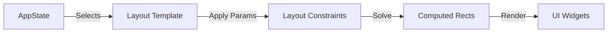
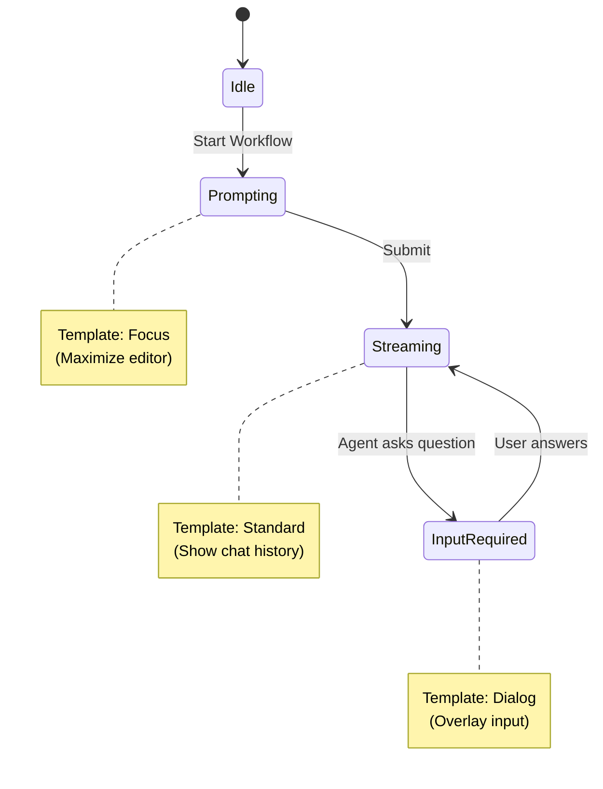

# Layout Management

In rustation v2, **Layout is State**.
We do not hardcode layout logic in render functions based on ad-hoc flags. Instead, layout configuration is explicitly stored in `AppState` and derived deterministically.

$$Layout = f(State)$$

---

## Core Principles

1.  **Declarative Over Imperative**: Describe *what* the layout should be (Templates/Constraints), not *how* to draw it.
2.  **Layout as State**: The active layout configuration is serializable.
3.  **Workflow-Driven**: The Active Workflow determines the Layout Template.

---

## The Layout Pipeline



### 1. Layout Template (The "Strategy")
High-level descriptions of the screen structure.

| Template | Description | Components |
| :--- | :--- | :--- |
| **Standard** | Default two-pane view | Sidebar (Left) + Content (Right) |
| **Focus** | Maximized content for writing | Content (Full Screen) |
| **Split** | Comparison or reference view | Content (Left) + Aux (Right) |
| **Dialog** | Overlay modal on top of Standard | Standard + Centered Dialog |

### 2. Layout Config (The "Parameters")
User-adjustable parameters for the templates. These are persistent settings.

- **active_template**: The currently selected template enum.
- **sidebar_width**: Width in characters (e.g., 25).
- **split_ratio**: Ratio for split view (e.g., 0.5).
- **show_help_footer**: Boolean toggle.

### 3. Computed Rects (The "Result")
The actual screen coordinates calculated by the Layout Engine.
**This is Derived State** (not serialized).

- `screen`: The full terminal area.
- `sidebar`: Area for navigation/list.
- `content`: Area for the main workflow.
- `aux`: Area for secondary content (diff/preview).
- `dialog`: Area for overlay input.
- `footer`: Area for status/help.

---

## Workflow-Driven Layout Transitions

The `AppState` doesn't just "have" a layout; the **Active Workflow** dictates the layout requirements.

### State Transition Diagram



### Transition Logic (Pseudo-code)

```python
function reduce(state, msg):
    match msg:
        case StartPrompt:
            state.workflow = PromptWorkflow
            state.layout.template = Focus
            
        case PromptSubmitted:
            state.workflow.step = Streaming
            state.layout.template = Standard
            
        case RequestInput:
            state.workflow.step = WaitingForInput
            state.layout.template = Dialog
```

---

## Testing Layouts

Because Layout is State, we can test it without rendering pixels.

**Scenario**: User toggles the sidebar.

1.  **Given**: `state.layout.template` is `Standard`.
2.  **When**: `reduce(state, ToggleSidebar)`.
3.  **Then**: `state.layout.template` should be `Focus`.

**Scenario**: Workflow starts.

1.  **Given**: `state.workflow` is `None`.
2.  **When**: `reduce(state, StartPrompt)`.
3.  **Then**: `state.layout.template` should automatically become `Focus`.

---

## Implementation Details

### Layout Engine
The Layout Engine is a pure function that takes `LayoutConfig` and `TerminalSize` and returns `LayoutRects`.

```python
function compute_layout(config, screen_area):
    if config.template == Standard:
        return split_horizontal(screen_area, config.sidebar_width)
    elif config.template == Dialog:
        base = split_horizontal(screen_area, config.sidebar_width)
        dialog = center_rect(screen_area, 60, 20)
        return base + dialog
    # ...
```

### Performance
Layout computation is fast (constraints solving), but we should avoid recomputing it if `State` and `TerminalSize` haven't changed. Caching the `LayoutRects` in `DerivedState` is recommended.
