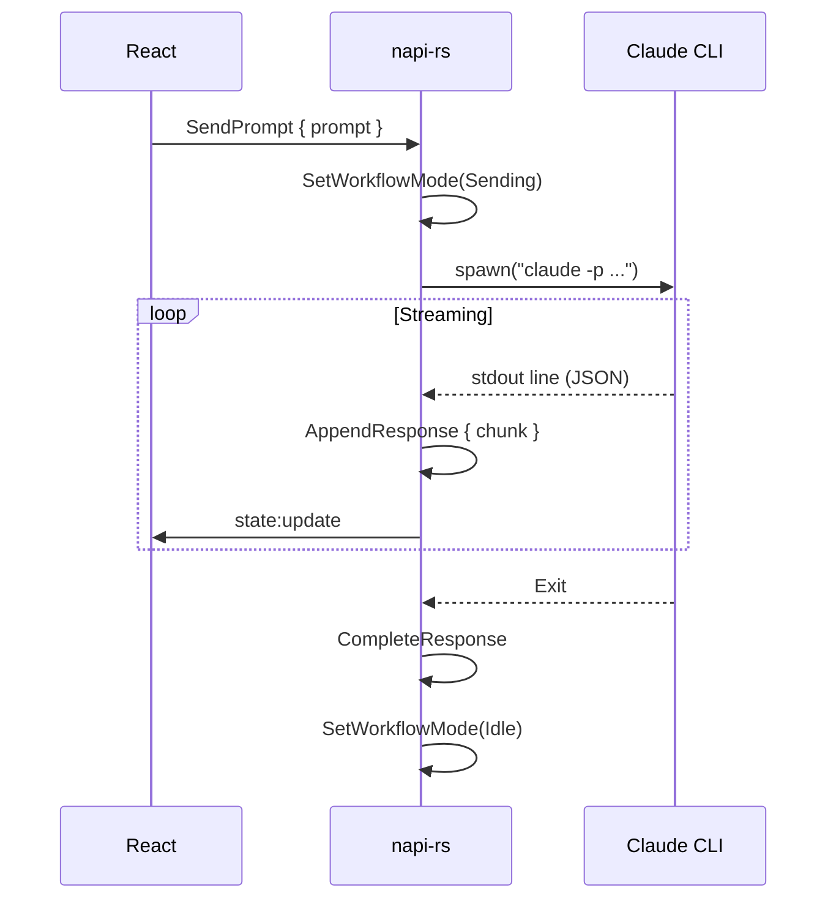

# Prompt-to-Claude Workflow (Planned)

## Overview

A dedicated workflow for interacting with Claude Code directly from rustation.

---

## Planned UI

```
┌─────────────────────────────────────────────────────────┐
│ Workflows                                               │
├─────────────────────────────────────────────────────────┤
│ ┌─────────────────────────────────────────────────────┐ │
│ │ Claude Response                                     │ │
│ │ ───────────────────────────────────────────────────│ │
│ │ I'll help you implement that feature...            │ │
│ │                                                     │ │
│ │ ```rust                                            │ │
│ │ fn new_feature() {                                 │ │
│ │     // implementation                              │ │
│ │ }                                                  │ │
│ │ ```                                                │ │
│ └─────────────────────────────────────────────────────┘ │
│ ┌─────────────────────────────────────────────────────┐ │
│ │ Type your prompt...                          [Send] │ │
│ └─────────────────────────────────────────────────────┘ │
└─────────────────────────────────────────────────────────┘
```

---

## Features

### 1. Prompt Input
- Multi-line text input
- File/folder attachment
- Context injection options

### 2. Streaming Response
- Real-time token streaming
- Syntax highlighting for code
- Auto-scroll with pause on manual scroll

### 3. Conversation History
- Previous prompts and responses
- Session persistence
- Clear/reset option

### 4. Context Injection
- Current file contents
- Project structure
- Docker service status
- Recent task outputs

---

## Claude CLI Integration

```bash
claude -p "prompt" \
  --output-format stream-json \
  --verbose \
  --mcp-config ~/.rstn/mcp-session.json \
  --append-system-prompt "Context: ..."
```

### Output Format (stream-json)

```json
{"type": "assistant", "message": {"content": [{"type": "text", "text": "..."}]}}
{"type": "result", "result": "...", "cost_usd": 0.01}
```

---

## State Extensions

```rust
pub struct WorkflowState {
    pub mode: WorkflowMode,
    pub prompt_input: String,
    pub conversation: Vec<ConversationEntry>,
    pub is_streaming: bool,
    pub session_id: Option<String>,
}

pub enum WorkflowMode {
    Idle,
    Composing,
    Sending,
    Receiving,
}

pub struct ConversationEntry {
    pub role: Role,
    pub content: String,
    pub timestamp: DateTime<Utc>,
}
```

---

## Actions (Planned)

| Action | Description |
|--------|-------------|
| `SetPromptInput` | Update prompt text |
| `SendPrompt` | Submit to Claude |
| `AppendResponse` | Add streaming chunk |
| `CompleteResponse` | Mark response complete |
| `ClearConversation` | Reset history |
| `SetWorkflowMode` | Update UI mode |

---

## Sequence Diagram



---

## References

- [MCP Integration](01-mcp-integration.md)
- [Architecture Overview](../implemented/00-architecture.md)
