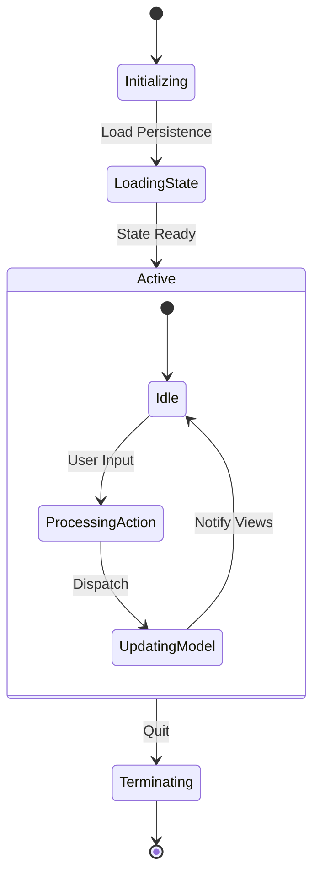
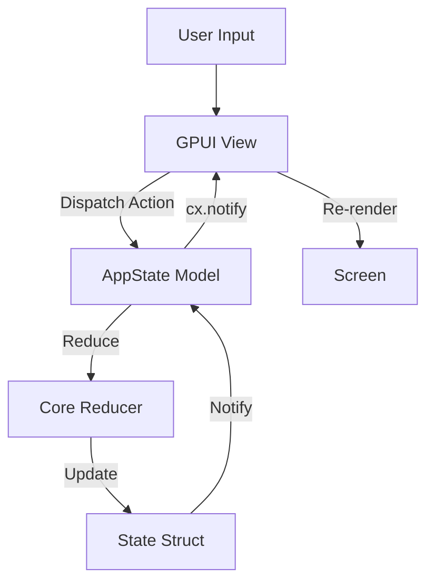
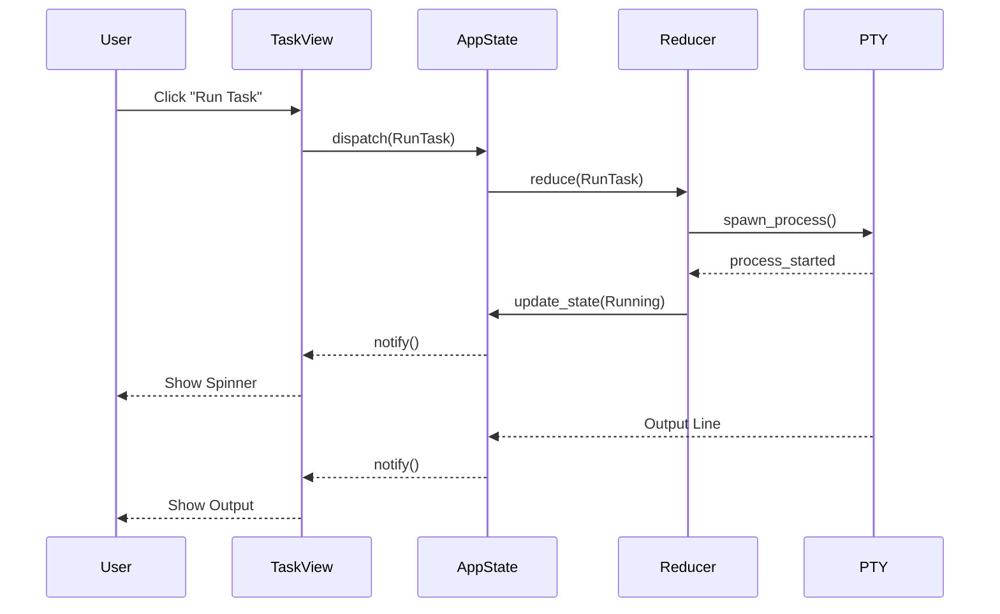
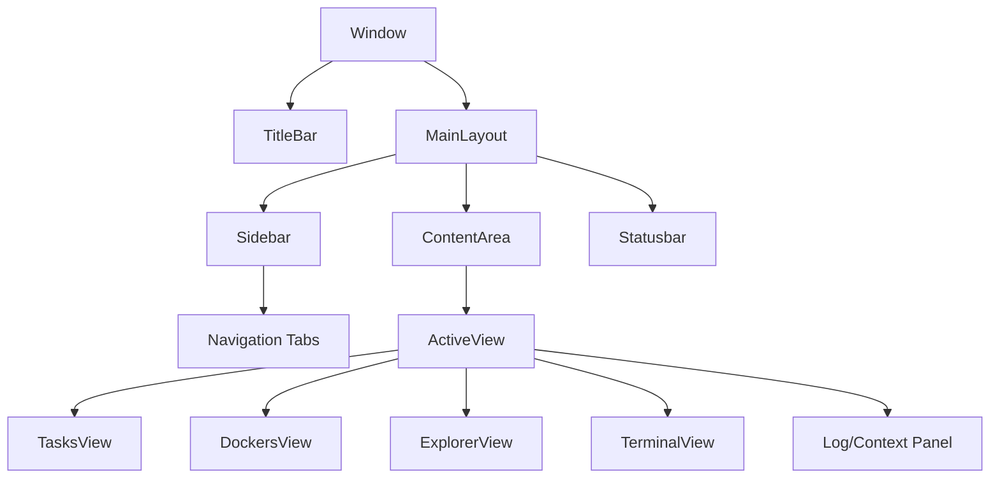

# Diagrams

## State Diagram

```mermaid
stateDiagram-v2
    [*] --> Initializing
    Initializing --> LoadingState: Load Persistence
    LoadingState --> Active: State Ready
    
    state Active {
        [*] --> Idle
        Idle --> ProcessingAction: User Input
        ProcessingAction --> UpdatingModel: Dispatch
        UpdatingModel --> Idle: Notify Views
    }
    
    Active --> Terminating: Quit
    Terminating --> [*]
```

## Flow Chart

```mermaid
flowchart TD
    User[User Input] --> View[GPUI View]
    View -->|Dispatch Action| AppState[AppState Model]
    AppState -->|Reduce| Reducer[Core Reducer]
    Reducer -->|Update| StateStruct[State Struct]
    StateStruct -->|Notify| AppState
    AppState -->|cx.notify| View
    View -->|Re-render| UI[Screen]
```

## Sequence Diagram

```mermaid
sequenceDiagram
    participant User
    participant TaskView
    participant AppState
    participant Reducer
    participant PTY

    User->>TaskView: Click "Run Task"
    TaskView->>AppState: dispatch(RunTask)
    AppState->>Reducer: reduce(RunTask)
    Reducer->>PTY: spawn_process()
    PTY-->>Reducer: process_started
    Reducer->>AppState: update_state(Running)
    AppState-->>TaskView: notify()
    TaskView-->>User: Show Spinner
    PTY-->>AppState: Output Line
    AppState-->>TaskView: notify()
    TaskView-->>User: Show Output
```

## UI Layout Diagram

```mermaid
graph TD
    Window[Window] --> TitleBar
    Window --> MainLayout
    MainLayout --> Sidebar
    MainLayout --> ContentArea
    MainLayout --> Statusbar
    
    Sidebar --> NavTabs[Navigation Tabs]
    
    ContentArea --> ActiveView
    ActiveView --> TasksView
    ActiveView --> DockersView
    ActiveView --> ExplorerView
    ActiveView --> TerminalView
    
    ActiveView --> RightPanel[Log/Context Panel]
```
