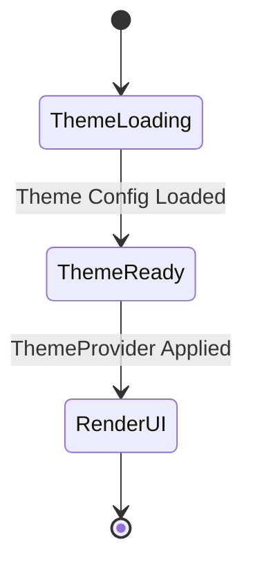
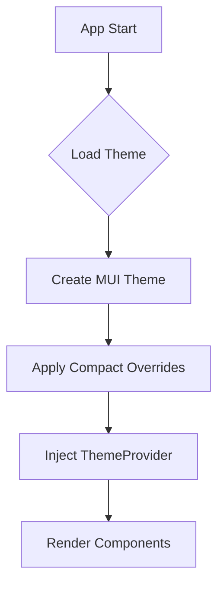
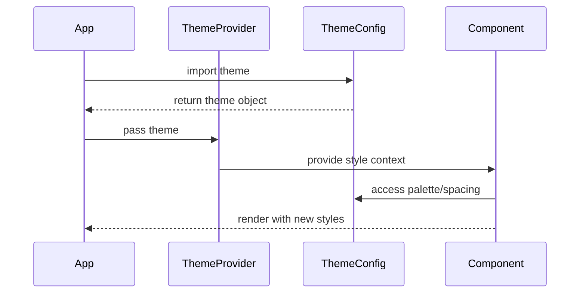

# Architecture Diagrams

## 1. State Diagram


## 2. Flow Chart


## 3. Sequence Diagram


## 4. UI Layout Diagram
```
┌──────────────────────────────────────────────────┐
│ ┌──────────────┐ ┌─────────────────────────────┐ │
│ │  ProjectTabs │ │      Global Toolbar         │ │
│ └──────────────┘ └─────────────────────────────┘ │
├──────┬───────────────────────────────────────────┤
│ Sidebar  │  Main Content Area                        │
│      │                                           │
│ Task │  ┌─────────────────────────────────────┐  │
│      │  │ Card (Compact)                      │  │
│ Exp  │  │ [Button] [Button]                   │  │
│      │  └─────────────────────────────────────┘  │
│ Set  │                                           │
│      │  ┌─────────────────────────────────────┐  │
│      │  │ Table (Dense)                       │  │
│      │  │ Row 1: Data                         │  │
│      │  │ Row 2: Data                         │  │
│      │  └─────────────────────────────────────┘  │
│      │                                           │
└──────┴───────────────────────────────────────────┘
```
